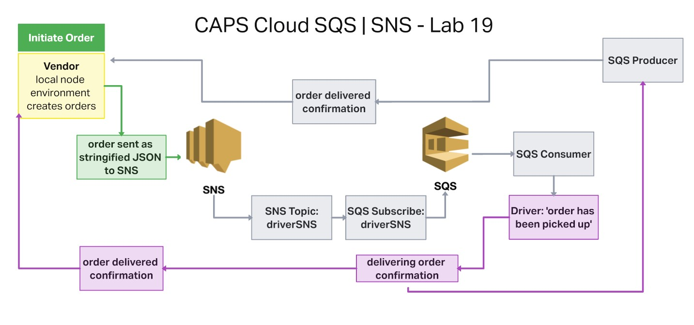
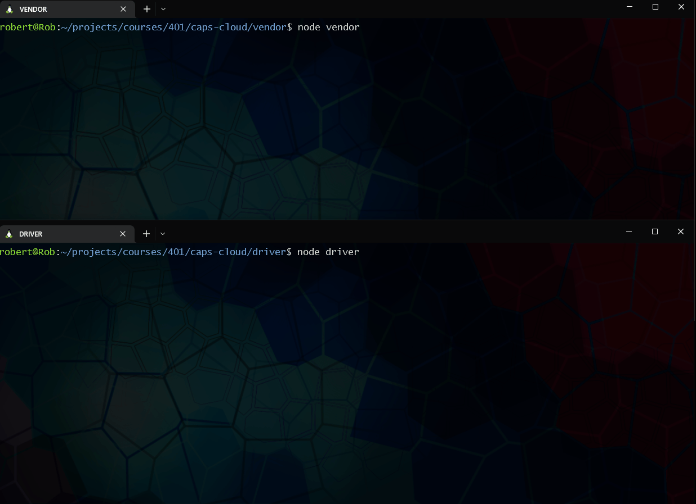

# CAPS Cloud SQS | SNS

## Code 401d48 lab 19

## Author: Robert Ball

Lab Collaboration - driver and vendor code modified from [Lab14](https://github.com/RDBALL/lab14-SQS) | Partnered Lab with [Alan Chelko](https://github.com/dtuskippy)

---

### Problem Domain

* Using only AWS Services: SQS, SNS, Lambda, create a cloud version of the [CAPS system](https://codefellows.github.io/code-401-javascript-guide/curriculum/apps-and-libraries/caps/)

---

### Requirements

Feature Tasks

* SNS Topic: pickup which will receive all pickup requests from vendors
* SQS Queue (FIFO): packages which will contain all delivery requests from vendors, in order of receipt.
  * Subscribe this queue to the pickup topic so all pickups are ordered
* SQS Queue (Standard) for each vendor (named for the vendor) which will contain all delivery notifications from the drivers

---

Documentation:

AWS Services used

* SNS
  * SNS created with a standard topic that will send notifications as they are received.
* SQS
  * SQS subscribed to SNS topic and will stage order notifications as they are received from the SNS topic

Application setup:

* Create an AWS account and create a new SNS topic and SQS application using the AWS console.
* Clone repo to your local system
* with the repo open in your editor of choice, run:
  * `npm init -y`
* install dependencies

```JSON
{
    "aws-sdk": "^2.1232.0",
    "chance": "^1.1.8",
    "sqs-consumer": "^5.7.0",
    "sqs-producer": "^2.1.0"
  }
```

When a local repo is established and all dependencies are installed, open two terminal instances and navigate to

`./vendor`

and

`./driver`

* Use the command `node vendor.js` while inside of the `./vendor` directory to create an order and send a payload to the driverSNS topic.

* Use the command `node driver.js` while inside of the `./driver` directory to consume SQS messages as they are sent to the SQS.

As an order is received by the vendor, the driver will acknowledge that an order has been picked up. The Driver will then send a message when the order has been delivered. The driver will produce a message to the SQS with delivery confirmation. The vendor will then consume the delivery confirmation and report the order id that has been delivered.

A 20 second interval between new orders has been set for the vendor and a 10 second interval between consuming SQS messages has been set for the driver to accommodate potential delays in SNS publishing and SQS consuming.

---

### Application UML



---

### Screen recording showing application functionality


